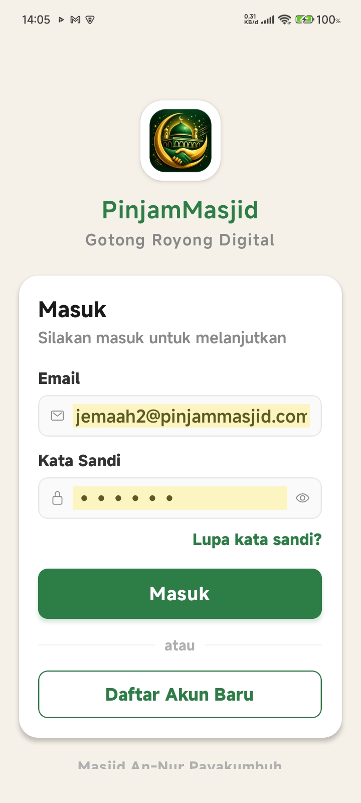
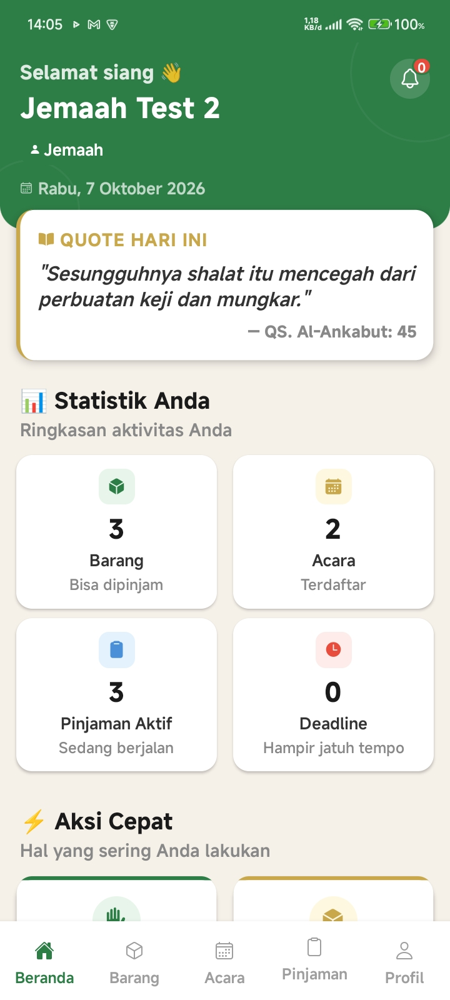
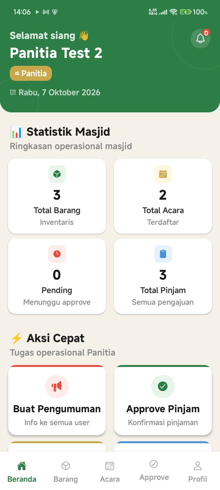
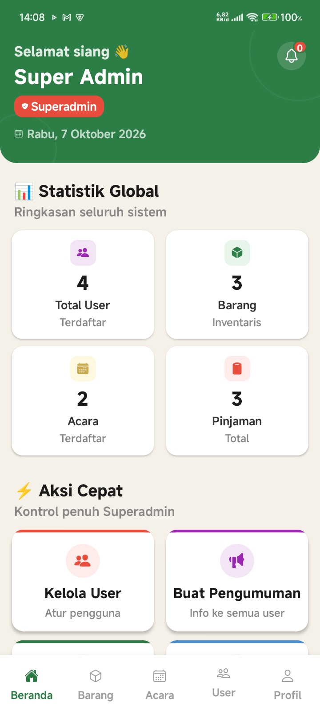
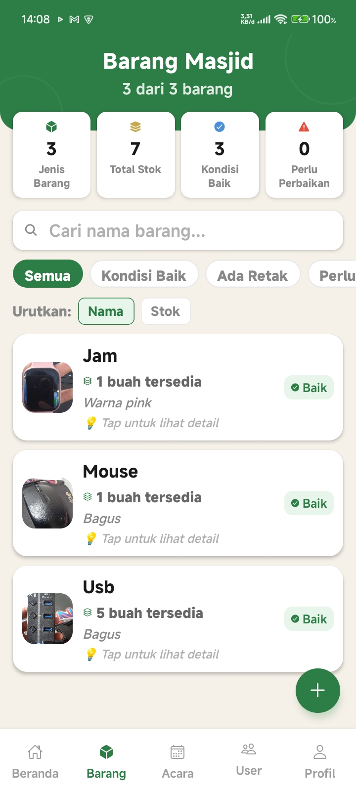
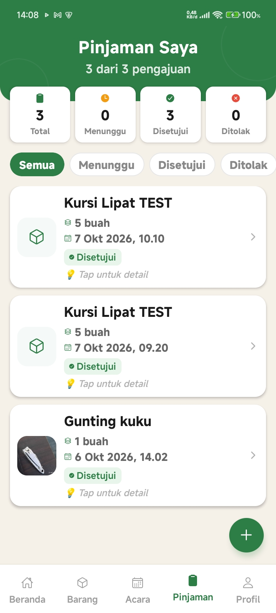
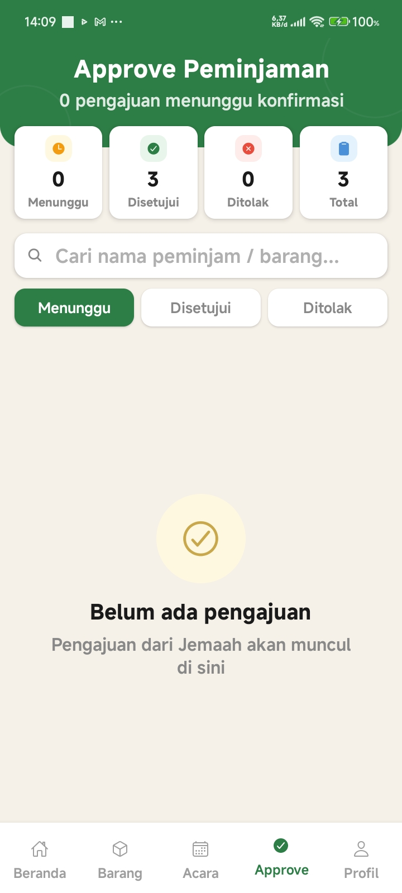
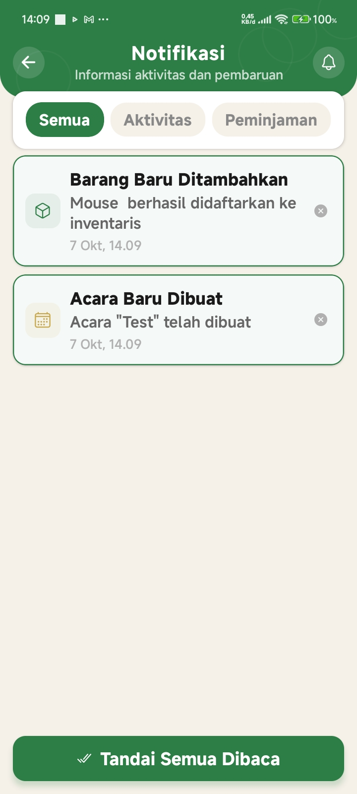

<div align="center">


# 🕌 PinjamMasjid

### Gotong Royong Digital

**Aplikasi manajemen inventaris & peminjaman barang masjid berbasis mobile**

[](https://reactnative.dev/)
[](https://expo.dev/)
[](https://supabase.com/)
[](https://www.typescriptlang.org/)
[](https://onesignal.com/)

[📱 Download APK](#-download-apk) • [✨ Fitur](#-fitur-utama) • [📸 Screenshot](#-screenshot-aplikasi) • [🛠️ Tech Stack](#️-tech-stack)

</div>

---

## 📖 Tentang Aplikasi

**PinjamMasjid** adalah aplikasi mobile yang dirancang untuk mempermudah pengelolaan inventaris dan peminjaman barang di masjid. Dibangun dengan teknologi modern, aplikasi ini memungkinkan jemaah untuk meminjam barang masjid secara digital, panitia untuk mengelola inventaris, dan superadmin untuk mengatur seluruh sistem.

> 🎯 **Dikembangkan untuk:** Masjid An-Nur Payakumbuh
>
> 🌟 **Visi:** Digitalisasi gotong royong masjid untuk generasi modern

---

## ✨ Fitur Utama

### 👥 Multi-Role System

Aplikasi ini memiliki **3 level pengguna** dengan hak akses berbeda:

<table>
<tr>
<td align="center" width="33%">

### 🟢 Jemaah

<hr>

- Lihat inventaris barang
- Lihat jadwal acara
- Pinjam barang masjid
- Lihat riwayat pinjaman
- Terima notifikasi approval

</td>
<td align="center" width="33%">

### 🟡 Panitia

<hr>

- Kelola inventaris barang
- Buat & kelola acara
- Approve/reject peminjaman
- Buat pengumuman
- Terima notifikasi peminjaman baru

</td>
<td align="center" width="33%">

### 🔴 Superadmin

<hr>

- Semua fitur Panitia
- Kelola user (approve/ban)
- Ubah role user
- Laporan lengkap
- Log aktivitas sistem

</td>
</tr>
</table>

---

### 🚀 Fitur Unggulan

| Fitur                     | Deskripsi                                                             |
| ------------------------- | --------------------------------------------------------------------- |
| 📦 **Inventaris Digital** | Kelola barang masjid dengan foto, jumlah, kondisi, dan harga          |
| 📅 **Manajemen Acara**    | Buat & jadwalkan acara masjid dengan notifikasi otomatis              |
| 🔔 **Push Notification**  | Notifikasi real-time via OneSignal — approval, acara baru, pengumuman |
| 📢 **Pengumuman**         | Sistem pengumuman dengan kategori (Penting, Info, Acara)              |
| 📊 **Laporan**            | Export laporan inventaris & peminjaman (PDF/Excel)                    |
| 👤 **Multi-Role Auth**    | Login dengan role-based access control                                |
| 🔐 **Keamanan**           | Password terenkripsi, session management, RLS Supabase                |
| 📱 **UI Modern**          | Design clean & intuitif dengan bottom nav dinamis per role            |

---

## 📸 Screenshot Aplikasi

<div align="center">

### 🔐 Login

|               Login               |                    Dashboard Jemaah                     |
| :-------------------------------: | :-----------------------------------------------------: |
|  |  |

### 👥 Dashboard Multi-Role

|                          Panitia                          |                           Superadmin                            |
| :-------------------------------------------------------: | :-------------------------------------------------------------: |
|  |  |

### 📦 Fitur Utama

|            Barang Masjid            |              Pinjaman Saya              |          Approve Peminjaman           |
| :---------------------------------: | :-------------------------------------: | :-----------------------------------: |
|  |  |  |

### 🔔 Notifikasi

|                 Notifikasi                  |
| :-----------------------------------------: |
|  |

</div>

---

## 🛠️ Tech Stack

### Frontend

- **React Native** — Framework mobile cross-platform
- **Expo SDK 54** — Development platform & build tools
- **Expo Router** — File-based routing
- **TypeScript** — Type-safe JavaScript

### Backend

- **Supabase** — PostgreSQL database + Auth + Storage
- **Supabase Edge Functions** — Serverless functions (Deno)
- **Row Level Security (RLS)** — Database-level security

### Notifications

- **OneSignal** — Push notification service
- **Firebase Cloud Messaging (FCM)** — Android push backend

### Build & Deploy

- **EAS Build** — Cloud build service
- **GitHub** — Version control & release

---

## 🚀 Cara Pakai

### Untuk Pengguna

1. **Download APK** dari [releases page](https://github.com/MuhammadReki/PinjamMasjid/releases)
2. **Install** di HP Android (min. Android 8.0)
3. **Daftar akun** sebagai Jemaah
4. **Tunggu approval** dari Panitia (untuk akun Panitia)
5. **Mulai gunakan** aplikasi

### Untuk Developer

```bash
# Clone repository
git clone https://github.com/MuhammadReki/PinjamMasjid.git
cd PinjamMasjid

# Install dependencies
npm install

# Setup environment variables
cp .env.example .env
# Edit .env dengan Supabase URL & Anon Key lu

# Jalankan development
npx expo start

# Build APK
eas build --platform android --profile production
```
